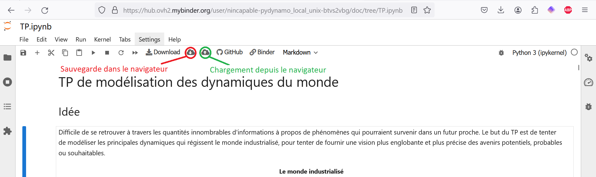
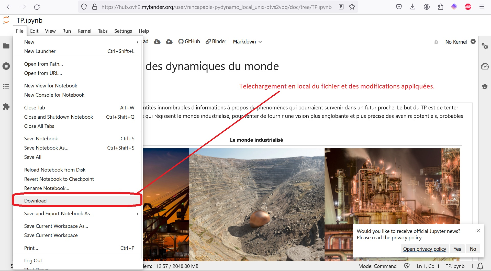
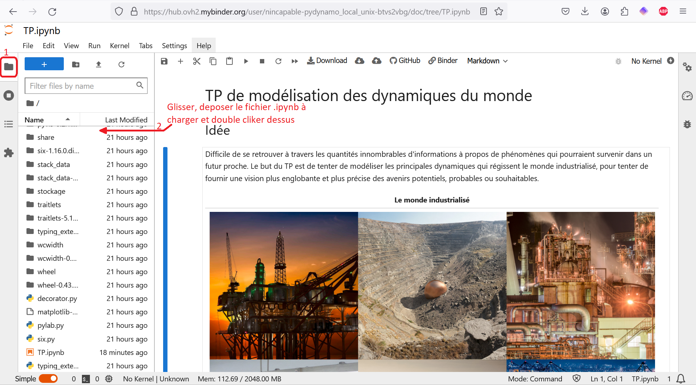

# Arbre de Décision Pydynamo

## Avec un Système Unix, ou une virtual machine

### Installation
- Télécharger le TP à l'adresse [https://gitlab.inria.fr/abaucher/pydynamo/-/raw/TPworld3/TP.ipynb?inline=false](https://gitlab.inria.fr/abaucher/pydynamo/-/raw/TPworld3/TP.ipynb?inline=false)

#### Option A: Avec le jupyterhub de l'UGA si vous avez un compte UGA
- Se connecter à [https://jupyterhub.univ-grenoble-alpes.fr](https://jupyterhub.univ-grenoble-alpes.fr) avec ses identifiants UGA
- Appuyer sur le bouton **upload** en haut à droite, et sélectionner le TP téléchargé
- Aller dans la rubrique **Nbextensions**, puis cocher les extensions:
  - *Exercise2*
  - *Table of Contents (2)*
- Revenir sur le menu files et lancer le notebook TP.ipynb en cliquant dessus

#### Option B: Autrement, en local sous Linux
- Exigences :
  - Il faut avoir Python3 
  - Le module a été testé sous Ubuntu 20
- Installation de python3
  ```bash
  sudo apt update
  sudo apt install python3
  sudo apt install python3-pip
  ```
- Créer un environnement virtuel
    - Il est préférable d'utiliser un environnement virtuel, qui assure les bonnes versions des librairies.
    - Pour installer et créer un nouvel environnement virtuel sous le nom de *dnovenv*:
    
        ```bash
        sudo apt install python3.10-venv
        python3.10 -m venv dnovenv
        ```
        
    - Pour l'activer, si on est dans le dossier qui contient le dossier `dnovenv`, il faut rentrer:
    
        ```bash
        source dnovenv/bin/activate
        ```
        
    - et peut-on le désactiver avec `deactivate`.
- Installer le TP

    - Ouvrir un terminal, puis installer Jupyter et activer les extensions:
    
        ```bash
        python3 -m pip install --upgrade ipykernel jupyter jupyter_contrib_nbextensions notebook==6.4.12
        jupyter contrib nbextension install --user
        jupyter nbextension enable exercise2/main
        ```
        
    - Ouvrir le TP.ipynb avec `jupyter-lab TP.ipynb`.
    
### Jouer

Dans le notebook TP.ipynb, des textes et morceaux de codes montrent l'idée et le fonctionnement de *Pydynamo* et du modèle World3. On peut faire différentes expériences de simulation en changeant des paramètres, et étudier certains phénomènes.
## Avec un Système Windows

### Installation de Python

- 1. Allez sur le site officiel de Python : [https://www.python.org.](https://www.python.org.)
- 2. Cliquez sur le lien de téléchargement pour obtenir la dernière version stable de Python pour Windows. Cela devrait être un fichier .exe.
- 3. Lancez l'exécuteur :
    - Cochez la case "Add Python to PATH" en bas de la fenêtre de l'installateur. Cela permettra de s'assurer que vous pouvez exécuter Python depuis n'importe quel répertoire dans la ligne de commande.
    - Cliquez sur "Install Now" pour installer Python avec les paramètres par défaut. Vous pouvez également choisir "Customize installation" pour spécifier des paramètres d'installation supplémentaires.
- Vérifiez l'installation avec ces commandes :
    ```bash
    python --version
    pip --version
    ```
- Installez le module *ipykernel* à l'aide des commandes :
    ```bash
    pip install --upgrade pip
    pip install ipykernel
    ```

### Installation du TP et de Nteract

- 1. Téléchargez et lancez l'installeur depuis la page *nteract.io* ([lien de téléchargement](https://github.com/nteract/nteract/releases/download/v0.28.0/nteract-Setup-0.28.0.exe))
- 2. Téléchargez le répertoire *pydynamo_local_windows_version* depuis GitHub ([lien de téléchargement](https://github.com/nincapable/Pydynamo_local_windows_version/archive/refs/heads/main.zip))
- 3. Dans le répertoire *pydynamo_local_windows_version*, ouvrez le fichier *TP.ipynb* avec Nteract.

### Jouer

Dans le notebook TP.ipynb, des textes et morceaux de codes montrent l'idée et le fonctionnement de *Pydynamo* et du modèle World3. On peut faire différentes expériences de simulation en changeant des paramètres, et étudier certains phénomènes.
## Pour ne rien installer

### Lancer le TP

Le TP peut être lancé dans un environnement virtuel Binder en utilisant le lien : [https://mybinder.org/v2/gh/nincapable/pydynamo_local_unix.git/HEAD?labpath=.%2FTP.ipynb](https://mybinder.org/v2/gh/nincapable/pydynamo_local_unix.git/HEAD?labpath=.%2FTP.ipynb)

Il est aussi possible de le faire par tout autre moyen équivalent qui exécute un environnement virtuel Unix en fournissant le lien du répertoire git : [https://github.com/nincapable/pydynamo_local_Unix_version.git](https://github.com/nincapable/pydynamo_local_Unix_version.git)

### Pour sauvegarder son travail

Il existe deux types de sauvegarde :

- 1. Une sauvegarde temporaire dans le navigateur, en cas de coupure avec le serveur, de problème d'alimentation etc.



- 2. Une sauvegarde permanente en téléchargeant le fichier modifié.


- 3. Chargement d'un fichier dans l'environnement.


### Jouer

Dans le notebook TP.ipynb, des textes et morceaux de codes montrent l'idée et le fonctionnement de *Pydynamo* et du modèle World3. On peut faire différentes expériences de simulation en changeant des paramètres, et étudier certains phénomènes.
